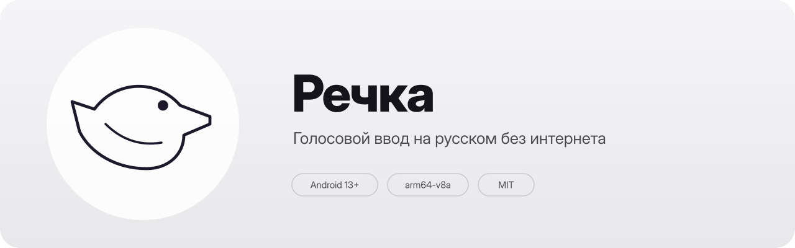

<p align="center">
  
</p>

# Речка

Голосовой ввод на русском для Android. Работает прямо на телефоне — без
интернета, без аккаунтов, без облака. Звук никуда не отправляется.

Речка — форк, основанный на оригинальном приложении «Говорун». Форк развивает
dm1sh; исходный проект и авторство оригинальной идеи сохранены в истории
проекта и в экране «О программе».

Под капотом:

- **[GigaAM v3](https://github.com/salute-developers/GigaAM)** — модель распознавания речи от Сбера, лицензия MIT
- **[sherpa-onnx](https://github.com/k2-fsa/sherpa-onnx)** — нативный ONNX-рантайм
- **[Silero VAD](https://github.com/snakers4/silero-vad)** — офлайновый детектор речевой активности

## Установка

Подписанный APK можно скачать на странице
[GitHub Releases](https://github.com/dm1sh/rechka/releases/latest).
Это установка из стороннего источника: Android 13+ может показать предупреждение
Play Protect, а для работы специальных возможностей потребуется разблокировать
«ограниченные настройки» — см. раздел [«Установка APK вручную»](#установка-собранного-apk-вручную) ниже.
SHA-256 APK публикуется в описании релиза — его стоит сверить перед установкой.

Также можно собрать приложение самостоятельно — инструкция приведена ниже.

### Установка модели

После установки APK откройте onboarding и нажмите «Скачать модель с GitHub».
Скачайте файлы модели в отдельную папку, например `Downloads/Rechka model`,
затем нажмите «Выбрать папку с моделью» и укажите эту папку. Корневую папку
«Загрузки» Android выбрать не разрешает. Приложение проверит имена, размеры и
SHA-256 файлов, скопирует только нужные файлы во внутреннее хранилище и не
сохранит доступ к выбранной папке. После успешной установки исходные файлы
можно удалить.

## Как это работает

Речка предлагает три способа работы с речью:

- плавающий микрофон поверх других приложений;
- голосовая клавиатура;
- расшифровка аудио- и видеофайлов.

### Плавающая кнопка

1. Включите Речку в настройках специальных возможностей.
2. Откройте любое поле ввода — поверх него появится плавающая кнопка.
3. Нажмите кнопку, говорите и нажмите её снова, чтобы остановить запись.
   Паузы разделяют длинную диктовку на абзацы.
4. Для короткой фразы удерживайте кнопку во время речи и отпустите её для
   остановки и вставки текста.

Плавающую кнопку можно перемещать по краю экрана. В настройках доступны её
размер, прозрачность, сторона экрана, автозапуск и режим рации. В режиме рации
запись идёт только во время удержания кнопки.

### Голосовая клавиатура

Речку можно включить как системную клавиатуру Android: Настройки → Система →
Клавиатура → Экранная клавиатура → «Речка — голосовой ввод». В её панели есть
микрофон, остановка и отправка записи, удаление символа, удаление слова,
очистка текста, отмена, повтор и переход на новую строку. Распознанный текст
вставляется в активное поле через стандартный интерфейс ввода Android.

### Расшифровка файлов

Аудио- и видеофайл можно открыть напрямую из файлового менеджера или медиаплеера
либо передать Речке через системное меню «Поделиться». Речка извлекает
аудиодорожку, обрабатывает файл на устройстве и показывает текст по мере
готовности сегментов.

Длинные файлы обрабатываются потоково. На экране видны прогресс и длительность
обработки, а уже распознанный текст не исчезает при добавлении новых сегментов.
Для файлов можно включить VAD в настройках: тогда границы фрагментов определяются
по речи и паузам. Если VAD выключен, декодированный звук обрабатывается
последовательными блоками длительностью не более 30 секунд, включая более
короткий последний фрагмент.

Все варианты распознавания работают без интернета. Поддерживаются аудио- и
видеоформаты, которые умеет декодировать Android, например WAV, MP3, M4A, OGG
и MP4.

## Технические детали

- Минимальная версия Android: 13 (API 33)
- Архитектура: `arm64-v8a`
- Модель GigaAM v3 — около 326 МБ, устанавливается отдельно во внутреннее хранилище приложения
- Silero VAD — около 629 КБ, зашит в APK
- APK не содержит GigaAM-модель; после установки её нужно скачать с GitHub и выбрать папку с файлами в onboarding
- Разрешение `INTERNET` в манифесте **не заявлено** — сетевого стека у
  приложения нет; всё распознавание идёт на устройстве
- Пакет: `ru.dm1sh.rechka`

## Сборка из исходников

Для локальной сборки нужны Android SDK с API 35, JDK 17 и установленный Android
NDK. Сначала создайте `local.properties` с путём к Android SDK:

```bash
echo "sdk.dir=/путь/к/android-sdk" > local.properties
```

Затем выполните подготовку зависимостей и нативного ресемплера:

```bash
# Нативный рантайм sherpa-onnx — около 47 МБ, в репозитории не хранится
./scripts/download-sherpa-onnx.sh

# Нативная библиотека FFmpeg/libswresample
./scripts/build-ffmpeg-swresample.sh
```

Соберите отладочный APK:

```bash
./gradlew --no-daemon assembleDebug
adb install --user 0 -r app/build/outputs/apk/debug/app-debug.apk
```

Отладочная сборка использует идентификатор приложения
`ru.dm1sh.rechka.debug`, поэтому может быть установлена рядом с обычной
`ru.dm1sh.rechka`. Рабочий процесс GitHub Actions подготавливает native runtime
и ресемплер, затем собирает APK командой `assembleDebug` и публикует его как
артефакт. Модель в APK не входит: её установка выполняется из onboarding уже
на телефоне. Для каждой сборки CI вычисляет возрастающий код версии по формуле
`19 + номер_запуска × 100 + номер_попытки`.

### Сборка релиза

Релизная сборка запускается при отправке тега, начинающегося с `v`, либо вручную
через GitHub Actions. Рабочий процесс требует секреты `RELEASE_KEYSTORE_BASE64`,
`RELEASE_STORE_PASSWORD`, `RELEASE_KEY_ALIAS` и `RELEASE_KEY_PASSWORD`, создаёт
конфигурацию подписи, подготавливает зависимости и выполняет:

```bash
./gradlew --no-daemon assembleRelease -PversionCode="$VERSION_CODE"
```

После сборки рабочий процесс публикует подписанный APK и файл карты R8 в
артефактах, а также создаёт релиз GitHub для выбранного тега.

## Установка собранного APK вручную

Если ставите APK в обход магазина (например, скачали готовый файл или
собрали сами и скинули на телефон), Android 13+ требует несколько
дополнительных шагов:

1. **Разрешить установку из неизвестных источников** для того приложения,
   из которого запускаете APK (браузер, файловый менеджер и т. п.).
   Настройки → Приложения → выбранное приложение → «Установка неизвестных
   приложений».

2. **Принять предупреждение Play Protect.** При первом запуске система
   может показать окно «Приложение не проверено». Нажмите «Всё равно
   установить» → «Установить».

3. **Разблокировать ограниченные настройки** (самый неочевидный шаг).
   Android 13+ по умолчанию блокирует Accessibility-сервис у сайдлоадных
   APK. Порядок действий:

   - Настройки → Специальные возможности → найдите Речка в списке.
     Он будет там, но серым и неактивным — переключатель не нажимается.
   - Нажмите на саму строку с Речкой. Всплывёт окно «Настройка
     недоступна в целях безопасности» с объяснением, что нужно
     разблокировать ограниченные настройки приложения.
   - Следуя подсказке из этого окна: Настройки → Приложения → Речка →
     троеточие в правом верхнем углу → «Разрешить ограниченные
     настройки». Пункт троеточия появляется только после того, как
     система один раз показала вам это окно — иначе в меню его нет.
   - Вернитесь в Специальные возможности и включите Речка.

Без этого шага переключатель так и останется серым.

## История версий

См. [CHANGELOG.md](CHANGELOG.md) — что менялось в каждой версии. Подписанные APK к каждому релизу — на странице [релизов GitHub](https://github.com/dm1sh/rechka/releases).

## Лицензия

Код приложения — MIT, см. [LICENSE](LICENSE). Приложение распространяется бесплатно как есть, без каких-либо гарантий — автор не несёт ответственности за возможный ущерб от использования.

Сторонние компоненты и их лицензии перечислены в
[THIRD_PARTY_LICENSES.txt](THIRD_PARTY_LICENSES.txt):

- **GigaAM v3** — модель Сбера, MIT
- **sherpa-onnx** — нативный рантайм, Apache 2.0
- **Silero VAD** — детектор речевой активности, MIT

Тот же файл доступен внутри приложения: «О программе» → «Лицензии».
